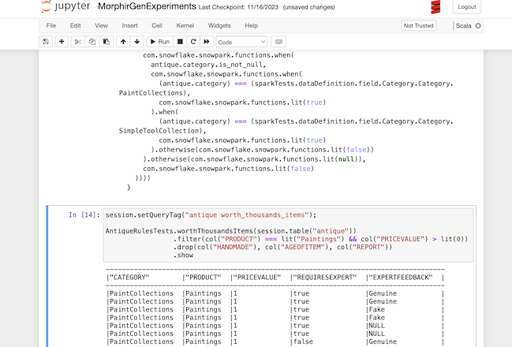

# Snowpark backend overview

## Introduction

**Morphir** is a system for capturing business logic in a [technology agnositic manner](https://morphir.finos.org/docs/intro/) . Morphir has an intermediate representation ([Morphir IR](https://morphir.finos.org/docs/morphir-ir)) that is used to store this logic. The [Morphir-elm](https://github.com/finos/morphir-elm) tool provides several backends for transpiling **Morphir-IR** to different languages and platforms.

The Morphir Snowpark backend for **Morphir-elm** generates [Scala](https://www.scala-lang.org/) code that uses the [Snowpark](https://docs.snowflake.com/en/developer-guide/snowpark/scala/index) API to represent operations expressed in **Morphir-IR**. From its documentation  [Snowflake Snowpark](https://docs.snowflake.com/en/developer-guide/snowpark/index) :

> ... provides an intuitive API for querying and processing data in a data pipeline.

## An example

The following [Elm](https://elm-lang.org/) code represents a query from the [Modeling for database developers](https://morphir.finos.org/docs/modeling-database-developers) section:

```elm
query1 : List Trade -> List { product : Int, qty : Int }
query1 trades =
    trades
        |> List.filter (\t -> t.buySell == "S")
        |> List.map
            (\t ->
                { product = t.productID
                , qty = t.quantity
                }
            )
```

The **Morphir-elm** Snowpark backend generates the following Scala code from this function definition:

```scala
  def query1(
    trades: com.snowflake.snowpark.DataFrame
  )(
    implicit sfSession: com.snowflake.snowpark.Session
  ): com.snowflake.snowpark.DataFrame = {
    val tradesColumns: mymodel.Basic.Trade = new mymodel.Basic.TradeWrapper(trades)
    
    trades.filter((tradesColumns.buySell) === (com.snowflake.snowpark.functions.lit("S"))).select(
      tradesColumns.productID.as("product"),
      tradesColumns.quantity.as("qty")
    )
  }  
```

## Snowpark backend and other backends

As with other backends provided by the **Morphir-elm** tool, this backend can be used to generate code from **Morphir-IR** . The `gen -t Snowpark` options are used to activate it.


The goal of the Snowpark backend is to generate code that takes advantage of the [DataFrame API](https://docs.snowflake.com/en/developer-guide/snowpark/scala/working-with-dataframes).  To do this, the backend analyses the code to [identify patterns of code](snowpark-backend-generation.md) in **Morphir-IR** that can be translated to use this API.  

There are programming practices do not adapt easily to DataFrame operations (for example recursive functions). In these cases the backend may not be able to generate useful code. This is one of the main differences with other backends such as the [Scala](https://morphir.finos.org/docs/scala-backend) or the [TypeScript](https://morphir.finos.org/docs/typescript-api) backends. See the [limitations](snowpark-backend-limitations.md) section for more information.


## Using the generated code

Code generated with this backend could be compiled and packaged into [JAR files](https://docs.oracle.com/javase/8/docs/technotes/guides/jar/jarGuide.html)  using any Scala or Java build tool like [Maven](https://docs.snowflake.com/en/developer-guide/snowpark/scala/setup-other-environments#using-the-snowpark-library-in-a-maven-project) or [sbt](https://docs.snowflake.com/en/developer-guide/snowpark/scala/quickstart-sbt#creating-a-new-scala-project-in-sbt) .  

These packages can then be used to create standalone programs or Snowflake [stored procedures](https://docs.snowflake.com/en/developer-guide/snowpark/scala/creating-sprocs) or [functions](https://docs.snowflake.com/en/developer-guide/snowpark/scala/creating-udfs) . It can also be used to explore code using Jupyter notebooks:



## Customizing the output

This backend supports customization by using [Morphir Decorations](https://morphir.finos.org/docs/decorations-users-guide).


More details in the [customization and execution section](snowpark-backend-using-and-customize.md).